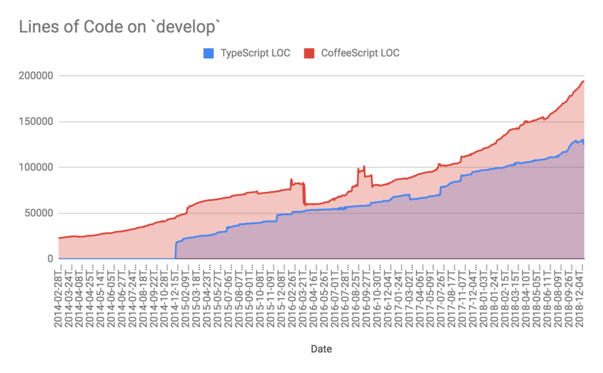
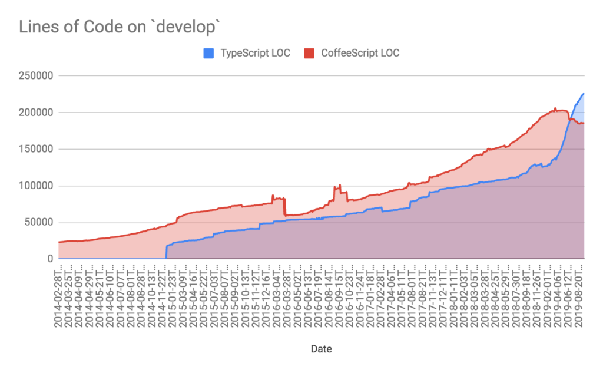
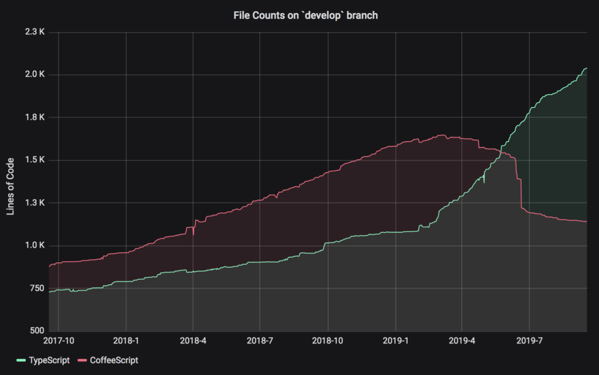

> This post was originally written for the [Heap engineering blog](https://www.heap.io/blog/migrating-to-typescript) while I was working as a Senior Software Engineer at Heap. It details our team's experience migrating a large CoffeeScript codebase to TypeScript and the lessons we learned about making large-scale technical migrations successful.

Over four years ago, Heap began to use TypeScript in place of CoffeeScript. Despite a broad preference for TypeScript among engineers, migration was slow and there was no clear path to a 100% TypeScript codebase.

In fact, if the goal was to switch entirely to TypeScript, we were moving in the wrong direction. Yes, we were adding TypeScript code, but we were adding CoffeeScript at a faster rate. TypeScript and CoffeeScript target the same Node.js runtime, which you'd expect to help ease the transition, but despite the widespread desire to shift we hadn't built up much momentum and we weren't trending towards a future without CoffeeScript.

In early 2019, we renewed our efforts to switch from CoffeeScript to TypeScript. This time, we decided that breathing life back into our migration would require us to rethink our strategy for converting existing code. Doing this led us to a new set of guiding principles. By following them, we turned what seemed to be an intractable slog into a manageable, well-understood process, and managed to significantly change the shapes of these curves:

So how did we do it? Here's what we realized.

## Tech stack migrations are about people as much as they are about tech

The most important realisation we had going into this renewed effort was that a successful migration has to be centered around people, not just tech. As engineers, we tend to be attracted to the technical motivations and (especially) the details of the migration: we all love the idea of gaining confidence in our code by moving to TypeScript, and we're all happy to spend hours figuring out exactly how we'll set up our TypeScript config.

As it turns out, the more important considerations lie on the human side of the equation: how do we get our coworkers to buy in to this new paradigm? This question raises a host of others. For example: how do we make developers happy and productive in this new model? What barriers or frictions can we remove to make the benefits of the new paradigm visible?

Following these questions helped us develop a new process for migration, one we're now quite proud of.

## The new development experience has to offer an obvious improvement

We quickly realized that to get the whole team on board, our developers had to feel like they'd be more productive when writing TypeScript. If the team saw the change simply as a neutral shift between syntaxes, we'd never get buy-in. If the switch didn't make their day-to-day experience more productive, inertia would win out, even if engineers generally prefer to write typed code.

We started by identifying areas of the codebase that, if converted, would produce substantial gains in productivity, knowing that converting files strategically would be a more compelling sell than arbitrary conversion. For example, our data access layer ("ORM") is ubiquitous, and most files use it in some way. Introducing types in the data access layer would be a force multiplier; nearly every file converted in the future would benefit from well-typed database models and utilities.

We also made tooling and configuration a priority. Most developers were using one of a few editors, so we created editor configs that would work off the shelf. We also added debug configurations, making it easy to set breakpoints and step through code.

Finally, we converged on a set of agreed upon linting rules which allowed us to write code in a unified style across the organization and get developers more comfortable with the transition.

When teams began to see the fruits of these conversion efforts, the whole project gained validation, and momentum increased. As our engineers began to see typed data access as an indispensable tool, they could more easily envision how other parts of the codebase might be similarly ripe for conversion.

## Break down technical barriers that discourage conversion

When we began analyzing TypeScript adoption patterns, it became clear that using TypeScript wasn't a seamless process for our engineers, who would often need to import special utilities (ts-node/register) or create intermediate CoffeeScript files that did nothing but import their TypeScript equivalents. In short, an interop story did exist, but it required a lot of boilerplate and too much trial and error to get right.

Were these points of friction the primary factor blocking migration? It's hard to say, but we know that the path of least resistance is a powerful force, and if we wanted people to switch we needed to make TypeScript the easy, obvious choice.

To do this, we prioritized efforts that would allow developers to write TypeScript in any service or component. Whether it's the back-end, front-end, scripts, or devops tasks, we wanted our engineers to be able to write code in TypeScript and have it just work. We ended up using the NODE_OPTIONS environment variable with -r ts-node/register so that existing workflows using the coffee command to run CoffeeScript files would continue to work.

## Keep your conversion process simple, safe, and automated

A language migration can be risky: what can seem like equivalent syntax between CoffeeScript and ES6/TypeScript may not be equivalent at all. And developers may see conversion as a good opportunity for refactoring–or worse, rewriting–which makes a risky migration even riskier.

To mitigate this, we needed a disciplined process for converting files without introducing regressions and reducing the temptation to do more than just the language conversion. The process also needed to be quick.

We settled on a two-part process: automated conversion of the CoffeeScript file, followed immediately by manual addition of basic type annotations and linter-related changes. The key is to resist the temptation to refactor the code in any meaningful way. Done this way, the conversion becomes a mechanical application of simple, safe rules, one that doesn't impact runtime behavior.

For the initial conversion, we used a script that converts a .coffee file to a .ts file. Under the hood, we use decaffeinate to go from CoffeeScript to ES6 JavaScript. Since all ES6 JavaScript is syntactically valid TypeScript, we then had a working file. (We've found decaffeinate to be an extremely mature and reliable tool.) This step was represented by a single, standalone commit in Git history.

The work wasn't done yet, though. We use TypeScript in strict mode, so features like "implicit any" are turned off. We used this conversion window as an opportunity to create type annotations for items where type inference wasn't possible. We avoided using any in this phase, instead opting for the stricter unknown. The goal in this phase was to make changes that would not result in runtime behaviour changes. We were not doing any kind of refactoring, just the minimum amount of work possible to get the code into a state where it compiled, linted, and passed tests.

If the dependencies of a module were already converted to TypeScript, there was very little effort needed: the types were mostly taken care of via the imported modules. This ended up producing a snowball effect, where conversion got easier and safer as more modules were converted.

This second step was also in a standalone commit; this made the code review process very straightforward, since the reviewer could easily see what changes were made after the decaffeinate step was finished.

The entire process was documented in a TypeScript conversion guide. Any Heap developer could convert a file and open a pull request to have it merged in as little as 5 minutes.

## #typescript: Give team members a place to ask questions and start discussions

Tackling a migration like this means asking your teammates to give up a way of doing their jobs that they're comfortable and effective with. The idea is that the new way will make them more productive. But getting to that point takes time and effort on their part. The last thing we wanted was a failure mode of a transition like this where developers would end up banging their heads against the wall because of broken tooling, confusing error messages, and inscrutable compiler errors. So our next priority was to figure out how to bootstrap team-wide expertise.

To do this we created a #typescript channel in Slack, and made sure developers getting stuck could get unblocked. The developers driving the migration made themselves available to answer questions, and stayed on the lookout for common issues and stumbling blocks. If the same problem kept cropping up, they'd know where to focus improvements.

Developers need to know that any language and tooling questions they have will be answered promptly. We decided to have the "TypeScript champions" prioritize questions ahead of their own work. While this slowed down their work, it also removed a number of potentially major blocks to the migration.

## Track progress

From the beginning, we knew that bulk, overnight migration was not a possibility, and that it would likely take a year or more to complete the process. This was fine: we decided that progress was more important than perfection.

We found that it was helpful to track our efforts over time. By seeing the steady progress over time, we could understand if we were still making progress. We used Grafana to visualize line counts. Here's another visualization showing file counts over time:

## Nice to have: leadership that respects engineers

Unfortunately, one of the factors that contributes most to your success in projects like these is something that lies slightly outside of your control: willingness of leadership to give you the space to do them. In this case, the migration project was a bottom-up effort: it started when I presented a plan to team leads and engineering managers, and once approved, we were given the freedom to figure out the best way to make it happen. Even though we were talking about a transition that will involve hundreds of thousands of lines of code, the migration was driven 100% internally.

In general, the best advocates for projects like this tend to be those teams that are using the tool in question on a daily basis. At Heap, we're lucky enough to have leadership that believes this too, and that supports the idea that leadership is often most helpful when it empowers engineers and then gets out of the way.

As we continue with this migration, we hope to keep learning, and to use this knowledge to make the next big project even easier.